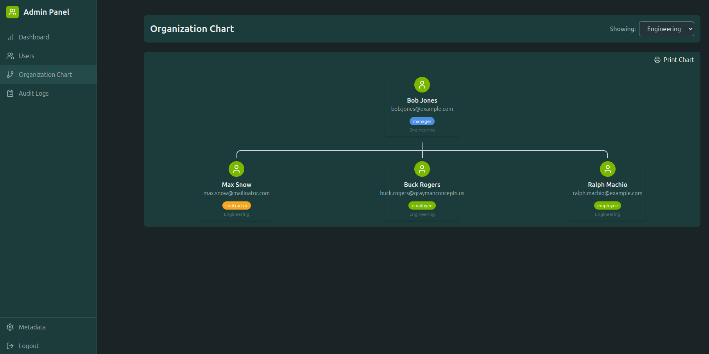

# User Administration System

A modern, feature-rich user administration system built with React and TypeScript. Manage users, track activities, and maintain organizational structure with a beautiful, responsive interface.


## 🌟 Features

### 📊 Interactive Dashboard
The dashboard provides real-time insights into your user base with interactive charts and statistics.
- Total user count
- Active vs. inactive users
- Recent login statistics
- Quick access to key functions

### 👥 Comprehensive User Management


Powerful user management interface with:
- Advanced search and filtering
- Department-based organization
- Bulk actions
- Role-based access control
- Status management (active/inactive/suspended)

### 📈 Organization Chart


Visualize and manage your organization's structure:
- Hierarchical view
- Department relationships
- Reporting lines
- Easy drag-and-drop organization

### 📝 Detailed Audit Logging


Comprehensive activity tracking:
- User actions
- System changes
- Login attempts
- Filtered view options

### ⚙️ Metadata Management


Flexible system configuration:
- Custom fields
- Role definitions
- Department structure
- System preferences

## 🛠 Technical Stack

### Frontend
- **React 18** with TypeScript
- **TailwindCSS** for styling
- **React Query** for data fetching
- **React Hook Form** for form management
- **Zustand** for state management
- **React Router** for navigation
- **Recharts** for data visualization

### Backend
- **Node.js** with Express
- **SQLite** database
- **JWT** authentication
- RESTful API architecture

## 🚀 Getting Started

1. Clone the repository
```bash
git clone https://github.com/yourusername/user-admin-system.git
cd user-admin-system
```

2. Install dependencies
```bash
npm install
```

3. Start the development server
```bash
# Start the backend server
npm run server

# In a new terminal, start the frontend
npm run dev
```

4. Access the system
```
URL: http://localhost:5173
Default Admin Credentials:
Email: admin@example.com
Password: admin123
```

## 🔒 Security Features

- JWT-based authentication
- Password hashing
- Role-based access control
- Activity logging
- Session management

## 🎯 Key Features in Detail

### User Management
- Create, read, update, and delete users
- Role assignment
- Department organization
- Status management
- Password reset functionality

### Reporting
- User activity logs
- System audit trails
- Usage statistics
- Custom report generation

### Organization
- Department management
- Hierarchical structure
- User relationships
- Role definitions

## 🤝 Contributing

Contributions are welcome! Please feel free to submit a Pull Request. For major changes, please open an issue first to discuss what you would like to change.

## 📝 License

This project is licensed under the MIT License - see the [LICENSE](LICENSE) file for details.
